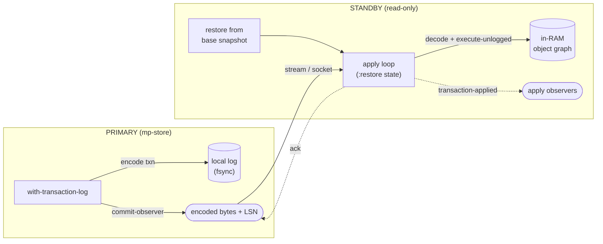
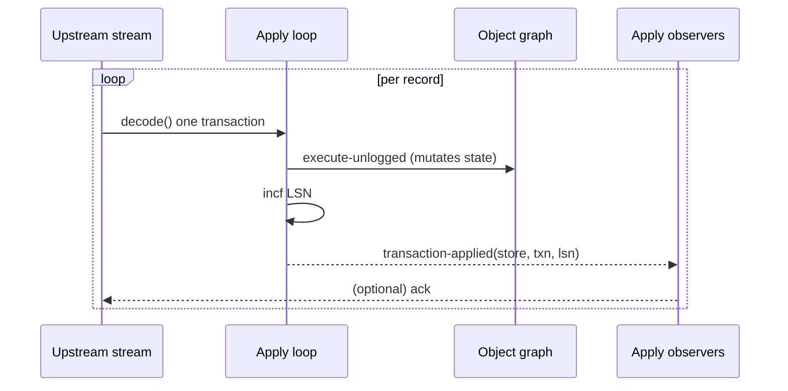

# Replication for bknr.datastore — design and rationale

This note describes how bknr.datastore can replicate a live store from a
**primary** to one or more **standby** replicas by shipping its transaction log,
and what the feature is composed of. It is meant to be read on its own, both by
reviewers of the replication code and by people who want to use the system.

It refers to the source as it stands today (`src/data/txn.lisp`,
`src/data/object.lisp`, `src/data/encoding.lisp`, and the
`bknr.datastore.replication` system under `src/replication/`).

---

## 1. Motivation and key insight

bknr.datastore is a single-node system: all objects live in RAM, all writes are
serialized behind one giant lock (`mp-store`, `txn.lisp:124-135`), and durability
is provided by `fsync`-ing an append-only transaction log on every transaction
(`with-transaction-log`, `txn.lisp:514-527`).

That same transaction log is an **almost ideal replication primitive**, for one
reason:

> **The on-disk format is identical to a usable wire format.**

Each record in the log is written with a single `(encode transaction out)` call
(`txn.lisp:525`) and read back with a single `decode` call in
`load-transaction-log` (`txn.lisp:734`). Each record is **self-delimiting** (a
tag plus length-prefixed fields), so `decode` consumes exactly one transaction
and leaves the stream positioned on the next. You can therefore stream the raw
log bytes straight over a socket and have the receiver call `decode` on it. No
new format is required — primary and standby already speak the same binary
language.

The standby apply loop is thus practically **the same loop that
`load-transaction-log` already runs at startup**, except it "restores"
continuously from a stream instead of once from a file.

---

## 2. Why replication fits here: determinism

Log shipping only works if replaying the same log yields the same state on the
standby as on the primary. bknr.datastore is already built for this, because
restore *is* replaying the log:

| Source of non-determinism | How bknr handles it | Reference |
|---|---|---|
| Time (`get-universal-time`) | The timestamp is captured at commit and **logged per transaction**; read back on replay, never re-evaluated | `txn.lisp:306-308`, `433-437` |
| Randomness (`*random-state*`) | The random state is persisted in the snapshot and **bound during replay** | `txn.lisp:217-252`, `462-472` |
| Object-id allocation | `make-instance` transactions carry an explicit `:id`; the snapshot encodes the current id (`#\I`) | `object.lisp:246-249`, `617-619` |
| Ordering | The giant lock gives a total order on all writes; the log preserves it | `txn.lisp:124-135`, `514-527` |

### The determinism contract

What remains is a contract the application must hold:

> **A transaction function must be a pure function of its logged inputs**
> (arguments + timestamp + random state).

A transaction that reads external state, does file I/O, or calls
`get-internal-real-time`, `gensym`, etc. will diverge between primary and
standby. The core already contains the seed for enforcing this: the
commented-out `disallow-cl-function-in-transaction` machinery at
`txn.lisp:801-816`, which in replicated mode should be revived as a strict
development-time check.

---

## 3. Architecture and what the feature is made of



The feature is deliberately split into two layers:

**A. Core hooks (in `bknr.datastore`).** A minimal, generic tap point in the
commit path, useful well beyond replication (audit, change-data-capture,
metrics):

- a **commit-observer** protocol — `add-commit-observer` /
  `remove-commit-observer` / `transaction-committed`. Observers are called with
  `(store transaction encoded-bytes lsn)` after every durably committed top-level
  transaction;
- a per-transaction **LSN** — a monotonic counter (`store-transaction-counter`)
  persisted at snapshot time (`current/transaction-id`) and advanced during
  replay, so a primary and a standby count in lockstep.

When no observers are registered the commit path is byte-for-byte identical to
before, and stores written before this facility default the LSN to 0.

**B. The replication module (`bknr.datastore.replication`).** Built on the core
hooks, and transport-agnostic:

- the **primary side** is a commit-observer
  (`make-stream-replication-observer`) that writes the raw encoded bytes to any
  sink stream;
- the **standby side** is `apply-replication-stream`, which decodes that stream
  and applies each transaction with the restore machinery, advancing the LSN and
  firing **apply observers**.

The integration point for both layers is the `with-log-guard` block in
`with-transaction-log` (`txn.lisp:523-527`). The existing `log-guard` lock
(`txn.lisp:191-193`) already serializes writes, so fanning out inside it ships
records in exactly the order they are committed.

---

## 4. Where to tap the stream — three options

From least to most invasive on the core:

### (a) Log tailer — zero core changes

A separate thread or process follows `current/transaction-log` by byte offset,
like `tail -f`, reading only **complete** records and shipping them. Fully
decoupled from the commit path and survives primary restarts, but purely async —
no way to gate commits on an ack.

### (b) Buffer fan-out — uses the commit-observer

Encode the transaction once into a buffer, write it to both the local log and
the replica connections. This is what the commit-observer enables, and it is
what makes semi-sync (waiting for an ack before commit returns) possible.

### (c) Stream-level tee — NOT recommended

Wrapping the log stream in a `broadcast-stream` breaks `fsync`: it digs out the
underlying file descriptor with `(sb-sys:fd-stream-fd stream)`
(`txn.lisp:494-501`), and a tee stream has no fd. **Tap at the transaction
level, not the stream level.**

---

## 5. The standby apply loop, and the apply hook

The standby opens its own store, restores from a base snapshot, then runs a loop
that decodes incoming transactions and applies them — **in `:restore` state**.
This is not optional:

- anonymous transactions *assert* `(eq :restore (store-state *store*))` on replay
  (`txn.lisp:640`);
- `:restore` state also prevents `last-change` slots from being overwritten with
  the apply time (`object.lisp:128-130`), so the standby reaches identical state.

**Operational prerequisite:** the same code must be loaded on the standby, or
applying signals `undefined-transaction` (`txn.lisp:489-491`). Replicas must be
deployed *before* the primary starts sending transactions that use new code.

### Apply observers — the integration point for reactive use

A crucial consequence: the primary's **commit-observer does not fire on the
standby**, because the standby applies via `execute-unlogged`, which never enters
the commit path. The standby therefore has its own **apply hook**
(`add-apply-observer` / `transaction-applied`) — a callback run after each
transaction is applied:



This hook is what lets a read replica:

- **push server-sent events / WebSocket** updates to its web clients on each change;
- **maintain derived / materialized views** (aggregates, secondary indexes that
  do not exist on the primary);
- **feed external systems** (search index, cache invalidation, analytics) — i.e.
  change-data-capture;
- **drive streaming or distributed computation** over the freshly-updated in-RAM
  object graph.

Apply observers run **inline in the apply loop**, so they must be cheap and
non-blocking — heavy work (sending SSE, computation) should be handed to a queue,
which is also why backpressure (§ 7) matters.

`replica-applied-lsn` returns the LSN of the last applied transaction; comparing
it with the primary's LSN gives the replication lag.

---

## 6. Durability and ack modes

| Mode | Behaviour | Failover guarantee | Latency |
|---|---|---|---|
| **Async** (default) | Primary fsyncs locally, ships in the background | An un-shipped tail can be lost on the replica on primary failure (but is on the primary's disk) | Lowest |
| **Semi-sync** | Primary waits for ≥1 replica to acknowledge **receipt** before commit returns | Committed data is on at least one replica | Higher |
| **Sync** (rarely desirable) | Primary waits until a replica has **applied** | Strongest, but couples commit latency to network + apply | Highest |

Semi-sync is implemented by having the fan-out block on an ack from a quorum
before returning.

---

## 7. Gaps to close (where the real work is)

1. **An LSN that survives snapshots.** `file-position` only orders records
   *within one log file*, and a snapshot **rotates the log**: `snapshot-store`
   renames `current/`→backup and builds a fresh empty `current/`
   (`txn.lisp:673-709`), resetting offsets. The persisted monotonic counter
   (§ 3A) addresses exactly this; a `(epoch . offset)` pair would also work.

2. **Snapshot / rotation coordination.** When the primary snapshots and rotates
   the log, replicas must follow over to the new log epoch instead of continuing
   to read the old (now backed-up) file. An explicit "epoch rollover" signal in
   the stream solves this.

3. **Per-record checksums.** A length prefix + CRC around each record lets a
   replica detect a truncated or corrupt record on the wire deterministically
   rather than misinterpreting bytes.

4. **Resync / catch-up protocol.** A new or lagging replica: copy the primary's
   latest snapshot directory, restore it, then subscribe to the live stream from
   the LSN matching that snapshot.

5. **Failover and fencing.** Promoting a replica to primary: stop applying, leave
   `:restore`, open its own log for append, start accepting writes. Fencing (or
   manual promotion) is needed to avoid split-brain if the old primary returns.

6. **Backpressure.** Apply observers and slow consumers must not stall the
   primary; bounded queues with a drop-or-disconnect policy.

7. **Read-your-writes consistency.** A client that wrote on the primary and reads
   on a replica can pass the LSN it needs the replica to have reached; the
   replica waits for that LSN or the read is routed to the primary.

---

## 8. Rollout phases

| Phase | Content | Core change | Result |
|---|---|---|---|
| **0 — cold standby** | Periodic rsync of snapshot + log; restore on failover | None | Backup, not "hot" |
| **1 — core hooks** | Commit-observer + persisted LSN | Small | Generic tap point |
| **2a — apply core** | Transport-agnostic apply loop + apply hook | New module | Real-time queryable replica (any stream) |
| **2b — network transport** | Socket server/client around the apply core (e.g. usocket) | None | Hot standby over the network |
| **3 — semi-sync** | Ack protocol, epoch/rotation coordination, checksums | Small | Committed data guaranteed on a replica |
| **4 — assisted failover** | Promotion, fencing, coordinator | Moderate | Fast, safe failover |

Phases 1 and 2a deliver a warm read replica with apply hooks and only a small,
generic change to the core; they also validate the determinism assumptions
before more is built.

---

## 9. Code sketch (illustrative)

```lisp
;;; ---- Primary: ship committed transactions to any sink ----

(add-commit-observer (make-stream-replication-observer sink-stream) primary-store)

;;; ---- Standby: apply the stream; reuse decode + execute-unlogged ----

(let ((standby (make-instance 'store :directory ... :make-default nil)))
  (add-apply-observer
   (lambda (store txn lsn)
     (declare (ignore store))
     (enqueue-sse-event (list :lsn lsn :change (summarize txn)))) ; cheap, non-blocking
   standby)
  (apply-replication-stream standby upstream-stream)) ; blocks, streaming updates

;;; ---- Network transport (phase 2b) is a thin wrapper:
;;;      a socket server on the primary feeds make-stream-replication-observer;
;;;      the standby connects and pumps the socket into apply-replication-stream.
```

The point: the standby loop reuses `decode` + `execute-unlogged` directly, and
the primary side is a thin layer around the existing commit path.

---

## 10. Summary

The transaction log makes bknr.datastore an unusually good candidate for
log-shipping replication, because replay *is already* the core mechanism for
restore, and because time, randomness, and id allocation are already logged
deterministically. The core needs only a small, generic tap point (a
commit-observer and a persisted LSN); everything else lives in a separate,
transport-agnostic module whose apply hook is the integration point for
server-sent events, derived views, and streaming computation. The remaining work
is operational maturity — rotation coordination, checksums, backpressure, and
safe failover — not the replication mechanism itself.

This moves the library from "excellent for one solid single-node system" toward
"suitable for high-availability services" without giving up what makes it
special: that you just write Lisp objects.
